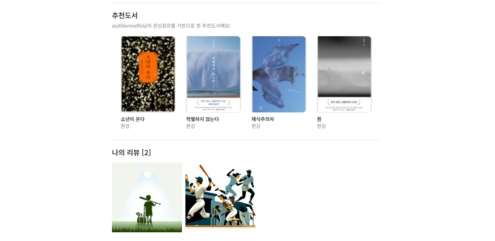

| 진행일 | 주제                                                                      |
| ------ | ------------------------------------------------------------------------- |
| 05/22  | accounts 구현, 로그인/회원가입 기능, user model custom(dj_rest_auth 사용) |
| 05/22  | 메인페이지 Navbar, 로그인, 회원가입 페이지 라우팅                         |
| 05/23  | API 명세 관리, 리뷰(쓰레드)/댓글 기능                                      |
| 05/23  | 도서 상세 페이지, 검색 결과 페이지 구현                                   |
| 05/24  | AI기능(작가정보) 구현                                      |
| 05/24  | 메인페이지 모든 리뷰(쓰레드), 리뷰 전체 페이지                          |
| 05/26  | AI기능(이미지 생성) 구현                                      |
| 05/26  | 리뷰 생성, 댓글 생성                           |
| 05/27  | 좋아요 기능                                      |
| 05/27  | 리뷰관련 페이지, 좋아요 기능, 마이페이지                           |

## 👥 팀원 정보 및 업무 분담 내역
| 이름       | 역할 및 업무                                                                                                              |
| ---------- | ------------------------------------------------------------------------------------------------------------------------- |
| **🐭조우영** | 프론트엔드 담당(Vue)<br/>- 웹에 표현할 데이터를 백엔드에 요청<br/>- API 명세를 올려주면 해당 주소로 요청해서 사용                   |
| **🐰제효정** | 백엔드 담당(Django)<br/>- 프론트로부터 요구사항을 받으면 모델 생성 후 API주소 전달<br/>- 서비스 AI기능 구현(작가 정보 출력, 감정기반 이미지 생성) |

## 🎯 목표 서비스 구현 및 실제 구현 정도
### 커뮤니티 생태계 만들기

- 유저들끼리 책의 리뷰를 남기고 좋아요를 눌러서 현재 어떤책이 인기가 있는지 실시간으로 확인할 수 있다.
- 리뷰/좋아요 기능을 구현하여 실시간으로 집계되는 책의 평점 순위, 리뷰의 좋아요 순 정렬 필터기능을 구현하여 어떤 책의 어떤 글이 인기있는지 확인 가능
### 나만의 책장 꾸미기

- 회원가입할때 입력한 나의 관심장르를 통해 책을 추천받고, 마이페이지 내에서 내가 남긴 리뷰를 통한 이미지를 모아놓고 확인할 수 있다.
- 외래키로 연결된 데이터를 이용해서 관심장르에 맞는 책을 필터링해서 기능을 구현

## 🗂️ ERD


## 📚 API 명세
| 페이지              | HTTP Method | 경로                                           | 인증 여부 |
|-------------------|-------------|----------------------------------------------|-----------|
| 로그인              | POST        | `/accounts/login/`                           |           |
| 회원가입            | POST        | `/accounts/signup/`                          |           |
| 마이페이지           | GET         | `/accounts/mypage/`                          | ✅  |
| 전체 도서 조회        | GET         | `/api/v1/books/`                             |           |
| 상세 도서 조회        | GET         | `/api/v1/books/<int:pk>/`                    |           |
| 리뷰 전체 페이지      | GET         | `/api/v1/books/threads/`                     |           |
| 리뷰 상세 페이지      | GET         | `/api/v1/books/threads/<int:pk>/`            |           |
| 댓글 작성           | POST        | `/api/v1/books/threads/<int:pk>/comments/`   | ✅  |
| 리뷰 좋아요          | POST        | `/api/v1/books/threads/<int:pk>/like/`       | ✅  |
| 리뷰 작성           | POST        | `/api/v1/books/threads/`                     | ✅  |
| 댓글 조회           | GET         | `/api/v1/books/threads/<int:pk>/comments/`   |           |
| 상세 도서 작가 정보 조회 | GET         | `/api/v1/books/<int:pk>/author/`             |
## 프로젝트 구조
```
📁 fontend/
├── 📁 public/
├── 📁 src/
├──── 📁 assets/        - 정적 파일 보관
├──── 📁 components/    - Vue 컴포넌트
├──── 📁 router/        - vue-router 설정 파일
├──── 📁 stores/        - Pinia 상태 관리
├──── 📁 views/         - 페이지 뷰
├──── 📄 App.vue        - 최상위 루트 컴포넌트
├──── 📄 main.js        - Vue 앱 진입
├── 📄 package.json
├── 📄 vite.config.js

📁 django-pjt/
├── 📁 accounts/        - 계정 관리
├── 📁 books/           - 책 관리
├── 📁 threads/         - 리뷰 관리
├── 📁 finalpjt/        - 프로젝트 설정
├── 📁 media/           - 미디어 파일 저장
```

## 🚀 핵심 기능에 대한 설명
### 1. 실시간으로 집계되는 커뮤니티 전용 베스트 셀러
- 독자들이 직접 읽은 책의 별점을 매기고 감상을 쓰며, 독자들의 평점을 모아서 해당 커뮤니티안에서의 베스트셀러가 생긴다.
- 메인페이지에서 책의 매겨진 평점의 평균을 오름차순으로 정렬하여 독자들에게 실시간으로 어떤 책이 현재 인기 있는지 보여준다.
### 2. 독자 리뷰 이미지 페이지
- 책의 감상을 토대로 이미지를 만들어주는 AI를 사용해서 마지 전시장에 온 듯한 느낌도 줄 수 있다.
- 메인페이지에 최근 리뷰를 사진위주로 정렬해서 풍성하고 활발한 커뮤니티라는 인식을 줄 수 있다.
- Dall·e3 모델을 사용하여 독자가 적은 설명에서 감정을 추출하고 이를 기반으로 그림을 그려주는 기능을 구현

## 🧠 생성형 AI를 활용한 부분
### 1. wikipidia API 활용
프롬프트를 작성하여 OPENAI에게 JSON형식의 데이터 요청
```python
# 프롬프트 사용 예시 일부
def generate_author_gpt_info(...):
    """GPT에 작가 소개 및 대표작 3권 이상 리스트 생성 요청"""
    prompt = f"""
    아래는 작가에 대한 정보입니다. 이 정보를 바탕으로 다음 내용을 JSON 형식으로 작성해 주세요.

    1. 작가 소개: 3~5줄 분량으로, 작가의 주요 특징과 업적을 포함
    2. 대표 작품 목록: 3권 이상의 작품 제목을 콤마(,)로 구분하여 나열

    [작가 이름]: {book.author}
    [책 제목]: {book.title}
    [위키피디아 요약]: 
    {wiki_summary}

    응답 형식:
    {{
        "author_info": "작가 소개 문단",
        "author_works": "대표작1, 대표작2, 대표작3"
    }}
    ...
    """
```
### 2. Dalle3 모델을 활용
프롬프트를 통해 감정을 추출하고 이를 기반으로 이미지 생성 요청
```python
# 모델 사용 예시
try:
    client = openai.OpenAI()
    response = client.images.generate(
        model="dall-e-3",
        prompt=full_prompt,
        size="1024x1024",
        quality="standard",
        n=1,
    )
```
## 💬 느낀점
### 조우영
: 첫 공동 프로젝트여서 어떻게 분담을 할까 하다가 프론트/백엔드로 나누어 진행을 해 보았다. 처음엔 내가 짠 코드가 아니어서 의심하여 여러번 확인을 했었지만 백엔드는 postman, 프론트엔드는 화면에 구현한것으로 확인하여 서로 필요한 부분을 요청하며 점점 의심없이 프로젝트를 성공적으로 진행할 수 있었다.<br/>
git repository관리가 조금 힘들었지만, 본인이 담당한 브런치에서 자유롭게 개발할 수 있어서 협업이 편리했다.

### 제효정
: 이번 프로젝트에서 백엔드 개발을 맡으며 데이터 흐름과 API 설계에 대한 이해를 한층 높일 수 있었습니다.<br/>
페어와 함께 소통하고 협력하는 과정을 통해 혼자보다 더 나은 방향으로 나아갈 수 있다는 협업의 가치를 느낄 수 있었습니다.